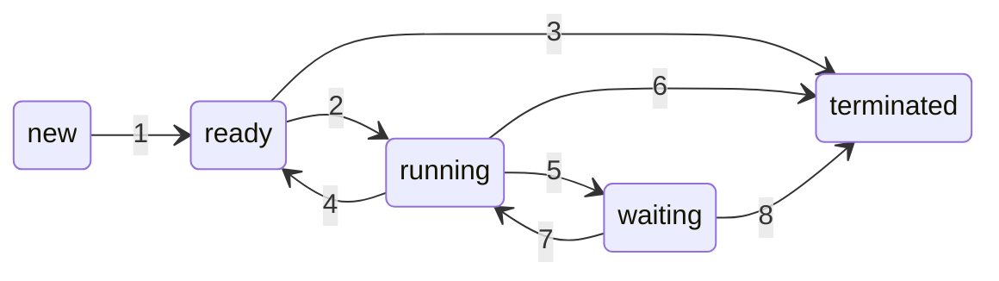

Il **processo** è un'istanza di un programma in esecuzione su un computer e rappresenta una delle unità fondamentali di gestione delle risorse da parte di un sistema operativo. Quando un programma viene eseguito, il sistema operativo crea un processo per esso, fornendogli le risorse necessarie, come CPU, memoria, accesso ai file e altri dispositivi.

Può essere visibile all'utente, come nel caso di un'applicazione durante la sua esecuzione, oppure può essere eseguito in background; per visualizzare la lista completa dei processi eseguiti su un computer e le relative risorse impiegate è possibile utilizzare un software comunemente chiamato _task manager_, mentre la gestione dei processi da parte del sistema operativo è affidata a un particolare programma, detto _process scheduler_, attraverso opportuni algoritmi di schedulazione%%link%%.

%%
Controllare nei codici di esempio che sia scritto tutto in italiano, verbi all'imperativo ecc.

---

\# Storia

I primi sistemi elaborativi consentivano l'esecuzione di un solo programma alla volta, che aveva il completo controllo del sistema e accesso a tutte le sue risorse. Gli attuali sistemi elaborativi consentono, invece, che più programmi siano caricati in memoria ed eseguiti in modo concorrente. Tale evoluzione richiede un più severo controllo e una maggiore compartimentazione dei vari programmi. Da tali necessità deriva la nozione di processo d'elaborazione – o, più brevemente, processo – che in prima istanza si può definire come un programma in esecuzione, e costituisce l'unità di lavoro dei moderni sistemi time-sharing.

---

3.3.2.1 Gerarchia dei processi Android
A causa dei vincoli imposti dalle risorse, come la memoria limitata, i sistemi operativi mobili possono aver bisogno di terminare
processi esistenti per recuperare risorse di sistema. Anziché terminare un processo arbitrario, Android ha definito una gerarchia di
importanza dei processi. Quando il sistema deve terminare un processo per rendere disponibili le risorse per un processo nuovo o più
importante, esso effettua la scelta di quale processo terminare in base all'ordine crescente di importanza. Dal più al meno importante,
la classificazione gerarchica dei processi è la seguente.
Processo in primo piano: il processo visibile sullo schermo, che rappresenta l'applicazione con cui l'utente sta attualmente
interagendo.
Processo visibile: un processo che non è direttamente visibile in primo piano, ma che sta eseguendo un'attività a cui il processo
in primo piano fa riferimento (vale a dire, un processo che esegue un'attività il cui stato è visualizzato dal processo in primo
piano).
Processo di servizio: un processo simile a un processo in background, ma che sta eseguendo un'attività evidente all'utente
(come lo streaming di musica).
Processo in background: un processo che può svolgere un'attività non evidente all'utente.
Processo vuoto: un processo che non contiene componenti attive associate a un'applicazione.
Se occorre recuperare risorse di sistema, Android interrompe prima i processi vuoti, poi i processi in background, e così via. Ai
processi viene assegnata una valutazione di importanza e Android assegna a un processo la posizione più alta possibile. Per esempio,
se un processo fornisce un servizio ed è anche visibile, gli verrà assegnata la classificazione di processo visibile più importante.
Inoltre, le prassi di sviluppo Android suggeriscono di seguire le linee guida del ciclo di vita dei processi, che prevedono che lo stato di
un processo sia salvato prima della sua terminazione e ripristinato quando l'utente ritorna all'applicazione.

---

Link a UNIX & Linux
Controllare che UNIX sia scritto tutto in maiuscolo

---

https://stackoverflow.com/questions/5815675/what-is-sock-dgram-and-sock-stream/60425748#60425748

%%

# 1 - Differenza tra "processo" e "programma"

La differenza tra il concetto di "processo" e quello di "programma" è fondamentale in informatica, poiché indicano concetti distinti legati all'esecuzione di un'applicazione:
- Un **programma** è un insieme di istruzioni scritte in un linguaggio di programmazione, che descrive quali operazioni un computer deve eseguire. È un'entità **passiva** e rappresenta il codice sorgente o il codice binario di un'applicazione, che viene memorizzato in un file su disco (es. un file eseguibile `.exe` su Windows, oppure un documento contenente codice sorgente scritto in un linguaggio di programmazione come Python o C). Un programma non fa nulla da solo finché non viene avviato.
- Un **processo** è un'istanza di un programma in esecuzione sulla memoria centrale (RAM). È un'entità **attiva** che include il codice del programma, lo stato della CPU (come il contatore del programma e i registri), lo spazio di memoria (segmento di testo e dei dati, stack e heap) e le risorse utilizzate dal programma. Quando un programma viene eseguito, il sistema operativo crea un processo per gestirne l'esecuzione.

Ecco una tabella riassuntiva:

| Caratteristica  | **Programma**                                      | **Processo**                                                  |
| --------------- | -------------------------------------------------- | ------------------------------------------------------------- |
| **Definizione** | Un insieme di istruzioni memorizzate su disco      | Un'istanza di un programma in esecuzione                      |
| **Stato**       | Entità passiva                                     | Entità attiva                                                 |
| **Memoria**     | Non usa memoria attiva                             | Utilizza memoria (segmento di testo e dei dati, stack e heap) |
| **Esecuzione**  | Non è in esecuzione                                | In esecuzione                                                 |
| **Durata**      | Permanente fino a quando è cancellato o modificato | Temporanea, esiste solo durante l'esecuzione                  |
| **Gestione**    | Non richiede gestione attiva                       | Gestito dal sistema operativo (CPU, memoria, I/O)             |
| **Relazione**   | Un programma può generare più processi             | Ogni processo è basato su un programma                        |

## 1.1 - Multipli processi, stesso programma

Sebbene due processi siano associabili allo stesso programma, sono tuttavia da considerare due sequenze d'esecuzione distinte: alcuni utenti possono, per esempio, far eseguire diverse istanze dello stesso programma di posta elettronica, così come un utente può invocare più istanze dello stesso browser. Ciascuna di queste è un diverso processo e, benché le sezioni di memoria contenenti il codice siano equivalenti, in realtà quelle dei dati, dell'heap e dello stack sono diverse. È inoltre usuale che durante la propria esecuzione un processo generi altri processi.

# 2 - Il PCB e le informazioni sul processo

Il **blocco di controllo del processo** (in inglese **_PCB_**, _**P**rocess **C**ontrol **B**lock_) è una struttura dati fondamentale utilizzata dal sistema operativo per memorizzare tutte le informazioni relative a un processo in esecuzione. Il PCB contiene informazioni cruciali per la gestione del processo, come il suo [stato](Processi.md#2.3%20-%20Stato%20di%20un%20processo), l'allocazione delle risorse, la sua posizione nella memoria e molto altro. Ogni processo attivo nel sistema ha un PCB associato, che viene creato al momento della sua inizializzazione, memorizzato nella RAM e aggiornato durante l'intero ciclo di vita del processo.

## 2.1 - Informazioni contenute in un PCB

Le informazioni contenute in un PCB variano a seconda delle implementazioni nei vari sistemi operativi, ma in generale sono presenti:
1. [**Stato del processo**](Processi.md#2.3%20-%20Stato%20di%20un%20processo): la condizione in cui si trova un processo in un dato momento durante la sua esecuzione nel sistema operativo (`new`, `ready`, `running`, `waiting` o `terminated`).
2. **Identificatore del processo** (in inglese _**PID**_, _**P**rocess **ID**_): un numero univoco assegnato al processo dal sistema operativo. Questo identificatore viene utilizzato per distinguere il processo dagli altri processi attivi.
3. **Program Counter** (abbreviato in _**PC**_): il PCB salva il valore contenuto nel Program Counter%%link%%, il registro nella CPU che rappresenta l'indirizzo dell'istruzione successiva che il processo deve eseguire. Se il processo viene interrotto, il Program Counter consente di riprendere l'esecuzione dal punto in cui è stata interrotta, perché appunto conterrà il valore dell'indirizzo di memoria in cui è presente l'istruzione del processo da cui ripartire.
4. **Contenuto dei registri della CPU**: il PCB salva il contenuto dei registri della CPU (es. accumulatori, puntatori allo stack, registri di uso generale) nel momento in cui il processo è stato interrotto. Questo è essenziale per riprendere correttamente l'esecuzione del processo in un successivo [cambio di contesto](Processi.md#3.4%20-%20Il%20cambio%20di%20contesto).
5. **Informazioni sulla gestione della memoria**: include dati su come la memoria è allocata al processo, come indirizzi di base e limiti di memoria del processo, oppure tabelle di paginazione o segmentazione, nel caso il sistema operativo utilizzi tecniche di gestione della memoria virtuale.
6. **Informazioni di I/O**: un elenco dei dispositivi di input/output utilizzati dal processo (es. file aperti, dispositivi hardware come stampanti, reti) e file descriptor che fanno riferimento ai file aperti dal processo.
7. **Informazioni di schedulazione**: un elenco delle informazioni utili alla schedulazione della CPU, come:
	- **Priorità del processo**: indica l'importanza relativa del processo rispetto agli altri.
	- **Tempo di esecuzione accumulato**: il tempo che il processo ha trascorso in esecuzione.
	- **Algoritmo di schedulazione utilizzato**: se il sistema operativo utilizza diverse politiche di schedulazione, nel PCB viene specificata quale viene usata.
8. **Informazioni di accounting**: dati utilizzati per tenere traccia del tempo CPU consumato dal processo, della quantità di risorse utilizzate e di eventuali statistiche di utilizzo, utili per la fatturazione o il monitoraggio delle prestazioni.
9. **Informazioni sui segnali**: elenco dei segnali che il processo può ricevere e le relative azioni da eseguire al ricevimento di un segnale (ad esempio, terminare il processo o ignorare il segnale).

## 2.2 - Funzione del PCB

Il PCB svolge un ruolo cruciale nel gestire i processi nel sistema operativo. Le sue principali funzioni includono:
- **Salvataggio del contesto del processo**: quando un processo viene sospeso (ad esempio, per un [cambio di contesto](Processi.md#3.4%20-%20Il%20cambio%20di%20contesto)), il suo stato (registri CPU, Program Counter, ecc.) viene memorizzato nel PCB. Quando il processo viene ripreso, il contesto viene ripristinato.  
- **Gestione della memoria**: il PCB tiene traccia delle risorse di memoria utilizzate dal processo, assicurando che il processo non acceda a zone di memoria riservate ad altri processi o al sistema operativo.
- **Identificazione del processo**: grazie al PID e alle altre informazioni contenute nel PCB, il sistema operativo può gestire un numero elevato di processi contemporaneamente, distinguendo un processo dall'altro.
- **Schedulazione e gestione della priorità**: le informazioni di priorità e di tempo di esecuzione accumulate nel PCB consentono al sistema operativo di decidere quale processo eseguire in un dato momento, ottimizzando l'uso della CPU.

## 2.3 - Stato di un processo

Lo **stato di un processo** rappresenta la condizione in cui si trova un processo in un dato momento durante la sua esecuzione nel sistema operativo. Il sistema operativo utilizza questi stati per gestire i processi in modo efficiente, garantendo che la CPU venga utilizzata in modo ottimale.

Gli stati principali di un processo sono:
- **`new` (nuovo)**: il processo è appena stato creato, ma non è ancora pronto per essere eseguito. Si trova in fase di inizializzazione, durante la quale vengono assegnate risorse come memoria e ID del processo.
- **`ready` (pronto)**: il processo è pronto per essere eseguito ma sta aspettando che la CPU diventi disponibile. In questo stato, il processo ha tutto ciò di cui ha bisogno per essere eseguito (memoria, dati, risorse), ma la CPU è attualmente occupata con un altro processo.
- **`running` (in esecuzione)**: il processo sta attualmente utilizzando la CPU e le sue istruzioni vengono eseguite. Il sistema operativo ha assegnato il controllo della CPU al processo, che sta attivamente svolgendo il suo lavoro.
- **`waiting` o `blocked` (in attesa o bloccato)**: il processo è in attesa di un evento esterno per continuare l'esecuzione. Questo evento può essere, ad esempio, il completamento di un'operazione di input/output (I/O), la ricezione di dati o un messaggio. In questo stato, il processo non può proseguire fino a che l'evento atteso non si verifica.
- **`terminated` (terminato)**: il processo ha completato la sua esecuzione o è stato interrotto in modo anomalo (per esempio, a causa di un errore). In questo stato, tutte le risorse del processo vengono rilasciate e il processo non esiste più nel sistema.

Questi termini sono piuttosto arbitrari e potrebbero variare a seconda del sistema operativo. Gli stati che rappresentano sono in ogni modo presenti in tutti i sistemi, anche se alcuni sistemi operativi introducono ulteriori distinzioni tra di essi. È importante capire che in ciascuna unità d'elaborazione può essere in esecuzione solo un processo per volta, sebbene molti processi possano essere pronti o nello stato di attesa.

### 2.3.1 - Cambiamenti di stato di un processo

In un sistema operativo, un processo può attraversare diversi **cambiamenti di stato** a seconda delle sue interazioni con le risorse del sistema e con altri processi. Questi cambiamenti di stato riflettono come il sistema operativo gestisce l'allocazione della CPU e l'attesa di eventi esterni, come l'input/output (I/O). Il seguente diagramma rappresenta la transizione tra i vari stati di un processo:



%%
Nel rendering sul sito, centrare il diagramma di Mermaid
%%

In particolare:
1. **`new` → `ready`**: dopo che il sistema operativo ha completato l'inizializzazione del processo e assegnato le risorse necessarie (come la memoria), il processo entra nello stato `ready`, in attesa di essere schedulato per l'esecuzione.
2. **`ready` → `running`**: il sistema operativo seleziona il processo dalla coda dei processi pronti e lo assegna alla CPU. A questo punto, il processo inizia a essere eseguito.
3. **`ready` → `terminated`**: anche se raro, un processo potrebbe essere terminato mentre è in stato `ready`, magari a causa di un'azione manuale dell'utente o per altre ragioni di sistema.
4. **`running` → `ready`**: il sistema operativo può interrompere il processo (ad esempio, a causa di un'interruzione del timer%%, come accade con l'algoritmo di schedulazione round-robin (aggiungere link)%%). In questo caso, il processo viene sospeso e rimesso nella coda dei processi pronti%%ready queue%%, aspettando di ottenere nuovamente la CPU.
5. **`running` → `waiting`**: se il processo richiede un'operazione di I/O o deve attendere che un evento specifico accada (ad esempio, il completamento di una lettura da disco), viene sospeso ed entra nello stato `waiting` fino a quando l'evento non si verifica.
6. **`running` → `terminated`**: quando il processo completa la sua esecuzione (o si verifica un errore fatale), entra nello stato `terminated`, liberando tutte le risorse allocate.
7. **`waiting` → `ready`**: una volta che l'evento atteso si verifica (ad esempio, un'operazione I/O termina), il processo torna nello stato `ready`, poiché ha tutto ciò di cui ha bisogno per continuare l'esecuzione e aspetta solo che la CPU diventi disponibile.
8. **`waiting` → `terminated`**: se il processo viene terminato durante l'attesa di un evento (ad esempio, un errore grave o una terminazione forzata dall'utente), il processo passa direttamente allo stato `terminated`.

Ecco una tabella riassuntiva delle transizioni di stato:

| Stato di partenza | Stato di arrivo | Descrizione della transizione                                  |
| ----------------- | --------------- | -------------------------------------------------------------- |
| `new`             | `ready`         | Il processo viene creato e preparato per l'esecuzione.         |
| `ready`           | `running`       | Il processo ottiene la CPU e inizia a essere eseguito.         |
| `ready`           | `terminated`    | Il processo viene terminato prima di essere eseguito.          |
| `running`         | `ready`         | Il processo viene sospeso (ad esempio, per multitasking).      |
| `running`         | `waiting`       | Il processo attende un'operazione I/O o un evento esterno.     |
| `running`         | `terminated`    | Il processo completa l'esecuzione o termina per errore.        |
| `waiting`         | `ready`         | L'evento atteso si verifica e il processo è pronto a eseguire. |
| `waiting`         | `terminated`    | Il processo viene terminato mentre attende un evento.          |

### 2.3.2 - Utilità degli stati

La gestione degli stati permette al sistema operativo di organizzare l'esecuzione dei processi in modo efficiente: ad esempio, quando un processo è in attesa (`waiting`), il sistema operativo può assegnare la CPU a un altro processo nello stato `ready`, garantendo che la CPU non rimanga inattiva.

## 2.4 - Spazio di memoria

Lo **spazio di memoria di un processo** rappresenta l'insieme di tutte le aree di memoria allocate per un processo dal sistema operativo. Questo spazio contiene il codice eseguibile, i dati e le strutture necessarie per far funzionare il programma. Ogni processo ha il proprio spazio di memoria isolato, separato da quello degli altri processi, garantendo che un processo non possa accedere o modificare direttamente la memoria di un altro processo: questa separazione migliora la sicurezza e la stabilità del sistema.

Lo spazio di memoria di un processo è solitamente diviso in:
1. **Segmento di codice (o segmento testo)**: contiene il codice eseguibile del programma, cioè le istruzioni che la CPU eseguirà. Il segmento di codice è generalmente di sola lettura, per evitare che il codice del programma venga accidentalmente modificato.
2. **Segmento dati**: contiene le variabili globali e statiche del programma, divise in:
	- **Dati inizializzati**: l'insieme delle variabili globali e statiche a cui è stato assegnato un valore al momento della dichiarazione.
	- **Dati non inizializzati** (in inglese **_BSS_**, _**B**lock **S**tarted by **S**ymbol_): l'insieme delle variabili globali e statiche che sono dichiarate ma non esplicitamente inizializzate, quindi non hanno un valore inizialmente definito; in alcuni sistemi operativi vengono inizializzate a zero.%%approfondire cos'è il BSS%%
3. **Heap**: è l'area della memoria dinamica utilizzata per l'allocazione di memoria a runtime. Quando un programma richiede memoria dinamica (ad esempio tramite funzioni come `malloc()` in C o `new` in C++/Java), questa viene allocata nello heap, il quale viene gestito unicamente dal programmatore stesso (cioè il programmatore è l'unico responsabile della gestione e del rilascio della memoria).
4. **Stack**: area di memoria che viene utilizzata per memorizzare variabili locali, parametri di funzione e indirizzi di ritorno da funzioni. Ogni volta che viene chiamata una funzione, un nuovo "frame" viene aggiunto allo stack, che contiene le informazioni relative a quella particolare chiamata. Quando la funzione termina, lo stack viene "srotolato" e il frame della funzione viene rimosso. Lo stack si espande e si contrae automaticamente durante l'esecuzione del programma, e la sua gestione è di solito curata dal compilatore e dal sistema operativo.
%%approfondire heap e stack in una pagina a parte sulla https://it.wikipedia.org/wiki/Gestione_della_memoria %%

Ecco una rappresentazione grafica dello spazio di memoria di un processo:


%%rimuovere questa foto e mettere uno schema fatto da me%%

### 2.4.1 - Variazione della grandezza dei segmenti di memoria

Si può notare che le dimensioni dei segmenti di codice e di dati sono fisse, ovvero non cambiano durante l'esecuzione del programma, mentre le dimensioni di stack e heap possono ridursi e crescere dinamicamente durante l'esecuzione:
- Ogni volta che si chiama una funzione, viene inserito nello stack una struttura dati detta _record di attivazione_ (in inglese _activation record_) contenente i suoi parametri, le variabili locali e l'indirizzo di ritorno; quando la funzione restituisce il controllo al chiamante, il record di attivazione viene rimosso dallo stack.
- Allo stesso modo, l'heap crescerà quando viene allocata memoria dinamicamente e si ridurrà quando la memoria viene restituita al sistema.

Visto che le sezioni dello stack e dell'heap crescono l'una verso l'altra, tocca al sistema operativo garantire che non si sovrappongano.

# 3 - Schedulazione dei processi

La **schedulazione dei processi** è il meccanismo attraverso il quale il sistema operativo decide quale processo deve essere eseguito dalla CPU in un dato momento. In un sistema multitasking%%link%%, più processi competono per l'utilizzo della CPU ed esiste un programma specifico (detto _process scheduler_) il cui ruolo è quello di assegnare la CPU a questi processi in modo efficiente, garantendo che il sistema risponda correttamente alle richieste degli utenti e ottimizzi le prestazioni.

## 3.1 - Obiettivi della schedulazione dei processi

Gli **obiettivi della schedulazione dei processi** sono:
1. **Massimizzare l'utilizzo della CPU**: ridurre i tempi morti della CPU, assicurando che sia sempre in uso.
2. **Condivisione equa**: assicurare che tutti i processi abbiano la possibilità di essere eseguiti, evitando che alcuni processi monopolizzino le risorse.
3. **Ridurre i tempi di risposta**: ridurre il tempo che intercorre tra la richiesta di esecuzione di un processo e l'inizio della sua esecuzione.
4. **Massimizzare la produttività**: aumentare il numero di processi completati in un intervallo di tempo.
5. **Ridurre il tempo di attesa**: minimizzare il tempo che un processo trascorre in attesa di essere eseguito.
6. **Garantire scadenze**: nei sistemi in tempo reale, garantire che i processi rispettino le loro scadenze temporali.

## 3.2 - Code di schedulazione

Le **code di schedulazione** (in inglese **_scheduling queues_**) sono strutture di dati utilizzate dal sistema operativo per gestire i processi in diverse fasi del loro ciclo di vita. Queste code aiutano il sistema operativo a organizzare e determinare quale processo deve essere eseguito, aspettare o bloccarsi, basandosi su determinati algoritmi di schedulazione%%link%%.

### 3.2.1 - Principali code di schedulazione

Le **principali code di schedulazione** sono:
1. **Job queue**: contiene tutti i processi nel sistema, indipendentemente dallo stato in cui si trovano. Non appena un processo viene creato, viene aggiunto a questa coda.
2. **Ready queue**: contiene tutti i processi che sono pronti per l'esecuzione (cioè nello stato `ready`) e in attesa che la CPU sia disponibile. Lo [schedulatore a breve termine](Processi.md#3.3%20-%20Tipi%20di%20schedulazione) sceglie i processi da questa coda per essere eseguiti. Questa coda è una delle più attive e importanti, poiché determina quali processi avranno accesso alla CPU.
3. **Device queue**: ogni dispositivo di I/O nel sistema ha una propria coda. Quando un processo richiede un'operazione di I/O, entra nella coda del dispositivo corrispondente e rimane bloccato finché l'operazione non viene completata. Dopo che l'I/O è completato, il processo può ritornare nella coda dei processi pronti. Per esempio, se un processo sta aspettando che venga completata la lettura da disco, sarà nella coda del disco fino al termine dell'operazione.
4. **Waiting queue**: contiene processi che sono bloccati in attesa di un evento (cioè nello stato `waiting`), come l'input da un dispositivo o il completamento di una richiesta di I/O. Quando l'evento atteso si verifica, il processo ritorna nella ready queue. È simile alla device queue, ma può anche includere processi in attesa di altri tipi di eventi non legati ai dispositivi di I/O.

### 3.2.2 - Rappresentazione in memoria delle code di schedulazione

Ogni coda generalmente viene memorizzata come una lista concatenata%%link%%, con un'intestazione della coda contenente i puntatori al primo [PCB](Processi.md#2%20-%20Il%20PCB%20e%20le%20informazioni%20sul%20processo) della lista che a sua volta comprende un campo puntatore che indica il successivo processo contenuto nella coda e così via:


%%eliminare questo schema e farne uno mio%%

## 3.3 - Tipi di schedulazione

Esistono diversi **tipi di schedulazione**, che variano in base a quando e come viene assegnata la CPU ai processi:
1. **Schedulazione a lungo termine** (in inglese **_job scheduler_**): decide quali processi devono essere caricati in memoria principale (RAM) dalla [job queue](Processi.md#3.2.1%20-%20Principali%20code%20di%20schedulazione). Il suo scopo è quello di controllare il grado di multiprogrammazione%%link%%, cioè il numero di processi che possono essere mantenuti in memoria e pronti per essere eseguiti contemporaneamente.
3. **Schedulazione a medio termine** (in inglese _**swapper scheduler**_): è responsabile del cosiddetto _swapping dei processi_, cioè dello spostamento temporaneo di processi in stato `waiting` dalla RAM a una memoria secondaria (per esempio su disco) per liberare memoria e fare spazio ad altri processi.
4. **Schedulazione a breve termine** (in inglese _**CPU scheduler**_): è l'unica schedulazione realmente necessaria in un sistema operativo, poiché decide quale processo tra quelli nello stato `ready` dovrà essere eseguito dalla CPU attraverso l'uso di diversi algoritmi di schedulazione%%link%%. Questo processo avviene molto frequentemente (nell'ordine dei millisecondi).

%%
\## Algoritmi di schedulazione

Esistono vari **algoritmi di schedulazione** utilizzati per determinare quale processo deve essere eseguito dalla CPU in un dato momento. I vari algoritmi di schedulazione hanno caratteristiche diverse che li rendono più adatti a determinati scenari (interattivi, in tempo reale, ecc.), e la scelta dell'algoritmo giusto dipende dai requisiti specifici del sistema.

\### 1. **First-Come, First-Served (FCFS)**

- **Descrizione**: I processi vengono eseguiti nell'ordine in cui arrivano. Il primo processo che arriva è il primo a essere eseguito.
- **Vantaggi**: Semplice da implementare.
- **Svantaggi**: Può causare il problema della **convoy effect**, dove i processi più lunghi bloccano l'esecuzione di quelli più brevi, aumentando i tempi di attesa.

\#### 2. **Shortest Job Next (SJN) o Shortest Job First (SJF)**:
- **Descrizione**: Il processo con il tempo di esecuzione più breve viene eseguito per primo.
- **Vantaggi**: Minimizza il tempo di attesa medio.
- **Svantaggi**: Difficile da implementare, poiché è necessario conoscere in anticipo la durata di ogni processo. Può causare **starvation** (processi lunghi potrebbero non essere mai eseguiti).

\#### 3. **Round Robin (RR)**:
- **Descrizione**: Ogni processo viene eseguito per un intervallo di tempo fisso (detto **quantum**), dopodiché la CPU passa al processo successivo in coda. Se un processo non termina nel suo quantum, viene reinserito in coda per essere eseguito più tardi.
- **Vantaggi**: Fornisce equità, poiché ogni processo ha un'opportunità di essere eseguito in modo ciclico.
- **Svantaggi**: Se il quantum è troppo lungo, il comportamento diventa simile a FCFS. Se è troppo breve, si ha un overhead elevato per i frequenti cambi di contesto.

\#### 4. **Priority Scheduling**:
- **Descrizione**: Ad ogni processo viene assegnata una priorità, e la CPU viene assegnata al processo con la priorità più alta. In caso di parità di priorità, si può usare un altro criterio, come l'FCFS.
- **Vantaggi**: Può essere utilizzato per dare la precedenza a processi importanti.
- **Svantaggi**: Può causare **starvation** per i processi con priorità bassa, che potrebbero attendere a lungo prima di essere eseguiti. Il problema può essere risolto con tecniche di **aging**, che aumentano la priorità di un processo man mano che rimane in attesa.

\#### 5. **Multilevel Queue Scheduling**:
- **Descrizione**: I processi vengono suddivisi in più code, ciascuna con una diversa priorità (ad esempio, processi interattivi in una coda e processi batch in un'altra). Ogni coda può avere il proprio algoritmo di schedulazione.
- **Vantaggi**: Permette di gestire diversi tipi di processi in modo efficace.
- **Svantaggi**: La separazione rigida tra code può causare squilibri nel carico della CPU.

\#### 6. **Multilevel Feedback Queue Scheduling**:
- **Descrizione**: Simile al multilevel queue, ma i processi possono "scendere" o "salire" da una coda all'altra in base al loro comportamento (es. se un processo usa troppo la CPU, può essere spostato in una coda a priorità inferiore).
- **Vantaggi**: Più flessibile rispetto al multilevel queue, permette di adattare la schedulazione alle caratteristiche di esecuzione dei processi.
- **Svantaggi**: Può essere complesso da implementare e configurare correttamente.
%%

## 3.4 - Il cambio di contesto

Il **cambio di contesto** (in inglese _**context switch**_) è l'operazione che il sistema operativo esegue per sospendere l'esecuzione di un processo attualmente in corso e passare l'esecuzione ad un altro processo. Questa operazione è essenziale per implementare il multitasking%%link%%, ovvero la capacità di un sistema di eseguire più processi quasi simultaneamente, facendo in modo che ciascun processo ottenga la CPU a turno.

### 3.4.1 - Utilità e vantaggi del cambio di contesto

Il cambio di contesto serve principalmente per:
1. [**Multitasking**](Processi.md#8%20-%20Multitasking): dovendo gestire più processi quasi simultaneamente, la CPU esegue ogni processo per un breve intervallo di tempo e poi passa a un altro processo, servendosi proprio del cambio di contesto e garantendo che ogni processo ottenga una porzione del tempo della CPU utile alla sua esecuzione.
2. **Prevenzione del monopolio della CPU**: in un sistema operativo multitasking, il cambio di contesto permette di sospendere temporaneamente un processo e riprendere l'esecuzione di un altro, assicurando che nessun processo monopolizzi la CPU. Questo permette a più programmi di essere eseguiti nello stesso momento senza che uno blocchi l'altro.
3. **Gestione dei processi bloccati**: quando un processo è bloccato (cioè è nello stato `waiting`, per esempio in attesa di un'operazione di I/O), il cambio di contesto consente alla CPU di passare immediatamente a un altro processo pronto per essere eseguito, ottimizzando l'utilizzo delle risorse.
4. **Risposta a eventi esterni**: il cambio di contesto può essere innescato da un interrupt%%link%% (ad esempio, l'arrivo di un input da tastiera o il completamento di un'operazione di I/O) che richiede l'attenzione del sistema operativo. Quando si verifica un evento esterno, la CPU può eseguire il cambio di contesto per gestire l'evento e successivamente tornare al processo precedente.
5. **Supporto alla concorrenza**: nei sistemi multiprocessore%%link%% o multithread%%link%%, il cambio di contesto consente a diversi [thread](Thread.md) o processi di essere eseguiti contemporaneamente o in sequenza sulla stessa CPU, migliorando la concorrenza tra le operazioni.
6. **Ottimizzazione del sistema**: permette di bilanciare [processi I/O-bound](Processi.md#4.1%20-%20Processo%20I/O-bound) (che richiedono più operazioni di I/O) e [processi CPU-bound](Processi.md#4.2%20-%20Processo%20CPU-bound) (che utilizzano intensivamente la CPU), migliorando le prestazioni complessive del sistema.

### 3.4.2 - Come funziona il cambio di contesto

Le fasi principali di un cambio di contesto sono:
1. **Salvataggio dello stato del processo corrente**: il sistema operativo salva lo stato corrente del processo (o thread) in esecuzione, inclusi i valori dei registri della CPU, il valore del Program Counter che tiene traccia dell'istruzione successiva da eseguire, lo [stato di un processo](Processi.md#2.3%20-%20Stato%20di%20un%20processo) e le altre informazioni necessarie per riprendere l'esecuzione in futuro. Queste informazioni sono memorizzate nel [PCB](Processi.md#2%20-%20Il%20PCB%20e%20le%20informazioni%20sul%20processo) del processo.
2. **Caricamento del nuovo contesto**: il sistema operativo carica il contesto del prossimo processo da eseguire dal suo corrispettivo [PCB](Processi.md#2%20-%20Il%20PCB%20e%20le%20informazioni%20sul%20processo), ripristinando i suoi valori dei registri della CPU e del Program Counter, quindi la CPU riprende l'esecuzione del nuovo processo da dove era stato interrotto l'ultima volta.
3. **Ripresa dell'esecuzione**: la CPU riprende l'esecuzione del nuovo processo dal punto in cui era stato sospeso.

Ecco un diagramma che illustra il cambio di contesto tra due processi $P_0$ e $P_1$:


### 3.4.3 - Costi del cambio di contesto

Il cambio di contesto è un'operazione che ha un costo in termini di tempo e risorse. Durante il tempo necessario per il cambio di contesto, nessun processo utente viene effettivamente eseguito: il cambio di contesto è puro overhead, perché il sistema esegue solo operazioni volte alla gestione dei processi e non alla computazione.

Il tempo necessario varia da sistema a sistema, dipendendo dalla velocità della memoria, dal numero di registri da copiare e dall'esistenza di istruzioni macchina appropriate (per esempio, una singola istruzione per caricare o trasferire in memoria tutti i registri). In genere si tratta di qualche millisecondo di computazione, ma la frequenza del cambio di contesto deve essere ottimizzata per evitare che un eccessivo numero di cambi riduca l'efficienza del sistema.

## 3.5 - Parametri di performance della schedulazione

Alcuni criteri utilizzati per valutare le prestazioni di un algoritmo di schedulazione includono:
- **Tempo di attesa**: il tempo che un processo trascorre nella coda dei processi pronti prima di essere eseguito.
- **Tempo di turnaround**: il tempo totale che un processo impiega dal momento in cui viene creato fino a quando termina (inclusi i tempi di attesa e di esecuzione).
- **Tempo di risposta**: il tempo che intercorre tra la creazione di un processo e il primo istante in cui il processo inizia a essere eseguito.
- **Throughput**: il numero di processi completati in un dato intervallo di tempo.

# 4 - Processi I/O-bound e CPU-bound

I concetti di **processi I/O-bound e CPU-bound** si riferiscono al tipo di risorse su cui un processo è più dipendente durante la sua esecuzione. La distinzione tra questi due tipi di processi è fondamentale per l'ottimizzazione delle prestazioni dei sistemi operativi e per la [schedulazione dei processi](Processi.md#3%20-%20Schedulazione%20dei%20processi).

## 4.1 - Processo I/O-bound

Un **processo I/O-bound** è un processo che passa la maggior parte del suo tempo in attesa di operazioni di I/O, come la lettura da o la scrittura su un disco, l'attesa di dati dalla rete, o l'interazione con dispositivi come tastiere e stampanti. Il tempo di esecuzione sulla CPU è relativamente breve rispetto al tempo trascorso in attesa di I/O.

### 4.1.1 - Caratteristiche principali dei processi I/O-bound

Le caratteristiche principali dei processi I/O-bound sono:
- **Uso intenso di I/O**: questi processi effettuano molte operazioni di input e output e, quindi, tendono a essere spesso bloccati (quindi nello stato `waiting`) fino a quando le operazioni di I/O non sono completate.
- **Breve tempo di utilizzo della CPU**: quando il processo ottiene il controllo della CPU, tende a eseguire solo un piccolo numero di calcoli prima di essere nuovamente bloccato per attendere l'I/O (ad esempio, un programma che attende frequenti input da parte dell'utente, come un editor di testo o un'applicazione interattiva, oppure un processo che trasferisce grandi quantità di dati da o verso un disco rigido).
- **Obiettivo della schedulazione**: i processi I/O-bound beneficiano di una schedulazione che li rimuova rapidamente dallo stato di attesa (quando l'I/O è completato) e gli assegni prontamente la CPU, per minimizzare i tempi di attesa e garantire che le operazioni di I/O siano gestite efficientemente.

## 4.2 - Processo CPU-bound

Un **processo CPU-bound** è un processo che trascorre la maggior parte del suo tempo effettuando calcoli sulla CPU e richiede relativamente poche operazioni di I/O. Il tempo speso in attesa di operazioni di I/O è trascurabile rispetto al tempo di utilizzo della CPU.

### 4.2.1 - Caratteristiche principali dei processi CPU-bound

Le caratteristiche principali dei processi CPU-bound sono:
- **Uso intenso della CPU**: Questi processi richiedono molto tempo di CPU per eseguire i loro calcoli e rimangono in esecuzione per lunghi periodi senza essere bloccati per operazioni di I/O.
- **Basso utilizzo di I/O**: I processi CPU-bound raramente richiedono accesso a dispositivi di input e output, quindi tendono a non essere frequentemente bloccati (es. un programma di elaborazione scientifica o di simulazione che esegue complessi calcoli matematici, oppure un software che genera immagini grafiche complesse o esegue algoritmi di compressione dati).
- **Obiettivo della schedulazione**: i processi CPU-bound possono richiedere quanti di tempo più lunghi, poiché tendono a utilizzare la CPU per periodi prolungati prima di completare il loro lavoro o di cedere la CPU.

## 4.3 - Differenze principali tra i due tipi

Ecco una tabella riassuntiva delle differenze principali tra i due tipi di processi:

| Caratteristica      | **I/O-bound**                                          | **CPU-bound**                                                  |
| ------------------- | ------------------------------------------------------ | -------------------------------------------------------------- |
| **Uso principale**  | Predomina l'attesa per operazioni di I/O               | Predomina l'uso intensivo della CPU per calcoli                |
| **Tempo in attesa** | Passa molto tempo in attesa di I/O (stato `waiting`)   | Passa la maggior parte del tempo eseguendo calcoli             |
| **Tempo sulla CPU** | Utilizza la CPU solo per brevi periodi                 | Utilizza la CPU per lunghi periodi senza interruzioni          |
| **Esempi**          | Editor di testo, programmi di rete, trasferimenti dati | Elaborazione scientifica, rendering grafico, compressione dati |
| **Schedulazione**   | Richiede una gestione rapida dell'I/O                  | Richiede tempi più lunghi di utilizzo della CPU                |

## 4.4 - Importanza per la schedulazione

Il sistema operativo deve tenere conto del tipo di processo (I/O-bound o CPU-bound) durante la schedulazione per ottimizzare le prestazioni del sistema:
- **Processi I/O-bound**: vengono solitamente eseguiti con maggiore priorità o con quanti di tempo più brevi per evitare che rimangano inutilmente in attesa di operazioni I/O completate.
- **Processi CPU-bound**: possono essere eseguiti con quanti di tempo più lunghi per evitare frequenti [cambi di contesto](Processi.md#3.4%20-%20Il%20cambio%20di%20contesto) e overhead associati, poiché tendono a utilizzare la CPU per periodi più estesi.

# 5 - Creazione di un processo

Ogni nuovo processo viene creato a partire da un processo già esistente: il processo creante viene detto _processo padre_ (in inglese _parent process_), mentre il nuovo processo è chiamato _processo figlio_ (in inglese _child process_). Il sistema operativo assegna al processo appena creato risorse (come spazio di memoria e tempo CPU) e lo aggiunge alla [job queue](Processi.md#3.2.1%20-%20Principali%20code%20di%20schedulazione).

## 5.1 - Fasi principali della creazione di un processo

Le fasi principali della creazione di un processo sono:
1. **Assegnazione di un PID**: ogni processo ha un identificatore univoco (solitamente rappresentato in memoria come un numero intero), noto come **_PID_** (_**P**rocess **ID**_). Il PID fornisce un valore univoco per ogni processo del sistema e può essere usato come indice per accedere a vari attributi di un processo all'interno del kernel%%link%%.
2. **Allocazione delle risorse**: vengono allocate le risorse necessarie per il nuovo processo, come lo [spazio di memoria](Processi.md#2.4%20-%20Spazio%20di%20memoria), i descrittori dei file aperti dal processo padre che possono essere ereditati o copiati da lui, il tempo di CPU e così via.
3. **Inizializzazione del contesto**: il sistema operativo crea un [PCB](Processi.md#2%20-%20Il%20PCB%20e%20le%20informazioni%20sul%20processo) per il processo figlio contenente tutte le informazioni di controllo necessarie, come lo stato del processo, i registri, i puntatori alla memoria, i file aperti e altro.
4. **Inserimento nelle code di schedulazione**: il processo viene aggiunto alla [job queue](Processi.md#3.2.1%20-%20Principali%20code%20di%20schedulazione), cioè alla coda di schedulazione contenente tutti i processi nel sistema.

%%https://it.wikipedia.org/wiki/Init
fare una sottosezione%%

## 5.2 - `fork()` in Unix/Linux

Nei sistemi Unix/Linux, la creazione di un nuovo processo avviene tramite la chiamata di sistema `fork()`. Questa chiamata crea una copia esatta del processo padre, ma con un nuovo PID. Il valore restituito dalla chiamata `fork()` è diverso per il padre e per il figlio: mentre il processo padre riceve il PID del processo figlio, il processo figlio riceve un valore pari a `0`, indicando che è il processo appena creato.

Un esempio di codice in linguaggio C che utilizza `fork()`:

```c
#include <stdio.h>
#include <unistd.h>

int main() {

	// Creazione di un nuovo processo figlio
    pid_t pid = fork();

    if (pid == 0) {
        // Codice eseguito dal processo figlio
        printf("Sono il processo figlio. PID: %d\n", getpid());
        
        // Array di argomenti per exec()
        char *args[] = { "ls", "-l", NULL };

        // Esecuzione di exec() utilizzando il percorso assoluto
        if (exec("/bin/ls", args) == -1) {
            // Se exec restituisce, c'è stato un errore
            perror("exec failed");
            exit(EXIT_FAILURE);
        }
    } else if (pid > 0) {
        // Codice eseguito dal processo padre
        printf("Sono il processo padre. PID del figlio: %d\n", pid);
        wait(NULL);
        printf("Processo figlio completato.\n");
    } else {
        // Errore durante la creazione del processo
        printf("Errore nella creazione del processo\n");
        exit(EXIT_FAILURE);
    }
    return 0;
}
```

Il processo figlio può poi sovrascrivere il suo spazio di memoria e l'eseguibile, entrambi ereditati dal padre, con una nuova immagine di processo tramite una chiamata come `exec()`, che permette di eseguire un programma differente all'interno del processo figlio.

## 5.3 - `CreateProcess()` in Windows

Nei sistemi operativi Windows, un nuovo processo viene creato tramite l'API%%link%% `CreateProcess()`. Questa funzione crea un nuovo processo e contemporaneamente un [thread](Thread.md) principale all'interno del processo.

A differenza di [`fork()`](Processi.md#5.2%20-%20`fork()`%20in%20Unix/Linux) che duplica il processo corrente, `CreateProcess()` consente di specificare il nome dell'eseguibile che il processo figlio deve eseguire. Questo significa che, in Windows, il processo figlio inizia immediatamente con l'esecuzione di un programma distinto.

Un esempio di codice in linguaggio C che utilizza `CreateProcess()`:

```c
#include <windows.h>
#include <stdio.h>

int main() {
   STARTUPINFO si;
   PROCESS_INFORMATION pi;

   // Zero-fill the structures
   ZeroMemory(&si, sizeof(si));
   si.cb = sizeof(si);
   ZeroMemory(&pi, sizeof(pi));

   // Create a new process
   if (CreateProcess(NULL,           // No module name (use command line)
					 "C:\\Program.exe", // Command line
					 NULL,           // Process handle not inheritable
					 NULL,           // Thread handle not inheritable
					 FALSE,          // Set handle inheritance to FALSE
					 0,              // No creation flags
					 NULL,           // Use parent's environment block
					 NULL,           // Use parent's starting directory
					 &si,            // Pointer to STARTUPINFO structure
					 &pi)            // Pointer to PROCESS_INFORMATION structure
   ) {
	   printf("Processo creato con successo!\n");
	   printf("PID del processo figlio: %d\n", pi.dwProcessId);

	   // Wait until child process exits
	   WaitForSingleObject(pi.hProcess, INFINITE);

	   // Close process and thread handles
	   CloseHandle(pi.hProcess);
	   CloseHandle(pi.hThread);
   } else {
	   printf("Errore nella creazione del processo.\n");
   }
   return 0;
}
```

# 6 - Terminazione di un processo

Un processo può terminare per vari motivi. Quando termina, le risorse assegnate al processo (come la memoria, i file aperti e il tempo CPU) vengono liberate dal sistema operativo. La terminazione di un processo può essere volontaria o forzata:
- **Terminazione volontaria**: il processo completa l'esecuzione del suo codice (ad esempio, l'utente chiude un programma). Ogni processo può chiamare esplicitamente la funzione di terminazione, usando come `exit()` in Unix/Linux%%link%% o `ExitProcess()` in Windows.
- **Terminazione forzata**: un errore o un'eccezione non gestita (come una divisione per zero o un accesso in memoria non valido) può causare la terminazione forzata del processo. Il sistema operativo o un altro processo può terminare forzatamente un processo tramite chiamate di sistema (ad esempio, tramite `kill()` in UNIX%%link%% o `TerminateProcess()` in Windows). Generalmente solo il processo padre del processo che si vuole terminare può invocare una chiamata di sistema di questo tipo, altrimenti gli utenti potrebbero causare arbitrariamente la terminazione forzata di processi di chiunque.

## 6.1 - Fasi principali della terminazione di un processo

Le fasi principali della terminazione di un processo sono:
1. **Richiesta di terminazione**: il processo chiama una funzione di uscita o riceve un segnale di terminazione. Questo avvia il processo di chiusura.
2. **Chiusura e liberazione delle risorse**: il sistema operativo chiude automaticamente tutti i file aperti dal processo. Anche altri tipi di risorse come [socket](Socket.md), canali di comunicazione%%link%%, semafori%%link%% o altre strutture di dati vengono rilasciate, così come lo [spazio di memoria](Processi.md#2.4%20-%20Spazio%20di%20memoria) assegnato al processo (sia quella per il codice che per i dati) viene liberato, in modo che possa essere utilizzato da altri processi.
3. **Aggiornamento dello stato del processo**: lo [stato del processo](Processi.md#2.3%20-%20Stato%20di%20un%20processo) nel [PCB](Processi.md#2%20-%20Il%20PCB%20e%20le%20informazioni%20sul%20processo) viene aggiornato in `terminated`. Finché il processo padre non recupera lo stato del processo figlio, si dice che quest'ultimo diventa un _processo zombie_ (in quanto il padre non sa che il processo figlio è morto).
4. **Liberazione del PCB dalle code di schedulazione**: il processo viene rimosso dalla coda dei processi pronti (la [ready queue](Processi.md#3.2.1%20-%20Principali%20code%20di%20schedulazione)) o da altre [code di schedulazione](Processi.md#3.2%20-%20Code%20di%20schedulazione). Il [PCB](Processi.md#2%20-%20Il%20PCB%20e%20le%20informazioni%20sul%20processo) del processo viene marcato per la rimozione o, nel caso di un processo zombie, viene mantenuto in memoria fino a che il processo padre recupera il suo stato.
5. **Notifica del processo padre**: se il processo è stato generato da un processo padre, quest'ultimo viene notificato della terminazione del figlio. Nei sistemi Unix/Linux, il padre può chiamare la funzione `wait()` per raccogliere il codice di uscita del figlio e permettere la completa rimozione del [PCB](Processi.md#2%20-%20Il%20PCB%20e%20le%20informazioni%20sul%20processo) del figlio dalla memoria.
6. **Rimozione del processo dal sistema operativo**: una volta che tutte le risorse sono state rilasciate e, se necessario, il processo padre ha recuperato il codice di uscita del figlio, il sistema operativo rimuove il [PCB](Processi.md#2%20-%20Il%20PCB%20e%20le%20informazioni%20sul%20processo) e altre strutture associate al processo dalla memoria. A questo punto, il processo è completamente terminato.

## 6.2 - Codice di uscita

Quando un processo termina, spesso restituisce un **codice di uscita** al sistema operativo o al processo padre. Questo codice è un valore numerico che indica se il processo è terminato correttamente o se si è verificato un errore. I valori solitamente usati sono:
- **Valore `0`**: indica che il processo è terminato con successo.
- **Un numero diverso dallo `0`**: indica un errore o una condizione specifica che ha causato la terminazione del processo (ogni numero viene solitamente assegnato a un errore specifico che lo identifica).

## 6.3 - Terminazione a cascata

La **terminazione a cascata** è un meccanismo che si verifica in un sistema operativo quando un processo termina e i suoi processi figli vengono automaticamente terminati insieme ad esso. Questo comportamento è spesso associato ai processi di tipo _daemon_%%link%% o ai servizi che, quando vengono interrotti, devono anche interrompere i processi che hanno creato.

### 6.3.1 - Funzionamento della terminazione a cascata

Quando un processo padre termina, i processi figli possono essere influenzati in diversi modi a seconda della loro relazione con il processo padre e della gestione dei segnali. Alcuni punti chiave della terminazione a cascata sono:
- **Segnale di terminazione**: quando un processo padre termina, può inviare segnali ai suoi processi figli. Se i processi figli non sono in grado di gestire il segnale di terminazione (come `SIGTERM` o `SIGKILL`), verranno terminati dal sistema operativo.
- **Processi orfani**: se un processo padre termina, i suoi processi figli diventano _orfani_. In UNIX e Linux, i processi orfani vengono adottati dal processo `init` (che ha [PID](Processi.md#2.1%20-%20Informazioni%20contenute%20in%20un%20PCB) con valore `1`), che si occupa di gestire la loro terminazione. I processi orfani non vengono necessariamente terminati a meno che non vengano esplicitamente chiesti di farlo.
- **Comportamento di `wait()`**: quando un processo padre utilizza la funzione `wait()`, attende la terminazione di uno dei suoi processi figli. Se il padre termina prima dei figli, il sistema operativo può terminare i figli se la relazione di dipendenza è tale che non ha senso che continuino a vivere.

### 6.3.2 - Esempio di terminazione a cascata in linguaggio C

Ecco un esempio in linguaggio C%%link%%, in cui un processo padre crea un processo figlio e poi termina. Se il processo padre termina, il comportamento dei processi figli può essere osservato.

```c
#include <stdio.h>
#include <stdlib.h>
#include <unistd.h>
#include <sys/wait.h>

int main() {
    pid_t pid = fork();

    if (pid < 0) {
        perror("fork failed");
        exit(EXIT_FAILURE);
    } else if (pid == 0) {
        // Questo è il processo figlio
        while (1) {
            printf("Processo figlio in esecuzione (PID: %d).\n", getpid());
            sleep(1);
        }
    } else {
        // Questo è il processo padre
        printf("Processo padre (PID: %d) in attesa di 5 secondi prima di terminare.\n", getpid());
        sleep(5);
        printf("Processo padre sta per terminare.\n");
        exit(0); // Termina il processo padre
    }

    return 0;
}
```

Durante l'esecuzione di questo programma, si può notare che il processo figlio continua a stampare i messaggi anche dopo la terminazione del processo padre, poiché diventa un processo orfano e viene adottato da `init`. Se invece il processo padre inviasse un segnale di terminazione, come `SIGKILL` o `SIGTERM`, anche il processo figlio verrebbe terminato, mostrando un comportamento di terminazione a cascata.

# 7 - Comunicazione tra processi (IPC)

Spesso, i processi hanno bisogno di comunicare e collaborare tra di loro scambiandosi dati. La **comunicazione tra processi** (in inglese _**IPC**_, _**I**nter-**P**rocess **C**ommunication_) riguarda le tecniche e i meccanismi attraverso cui i processi di un sistema operativo, che possono essere eseguiti in parallelo o separatamente, scambiano informazioni tra loro. Ogni metodo di comunicazione tra processi ha vantaggi e svantaggi, ed è scelto in base alle esigenze specifiche di sincronizzazione, latenza, throughput e complessità dell'applicazione.

%%
Le tecniche di comunicazione tra processi si dividono nelle seguenti tre categorie:
- **Tecniche di scambio di dati**: tecniche utilizzate per lo scambio di dati fra processi.
- **Tecniche di sincronizzazione**: tecniche utilizzate per sincronizzare le azioni dei processi in comunicazione.
- **Segnali**: sebbene i segnali siano nati prevalentemente con altri fini, in alcune circostanze possono essere utilizzati come strumenti di sincronizzazione (wut?)

%%

Le principali tecniche di comunicazione tra processi sono:
- [**Pipe**](Pipe.md): permettono la comunicazione unidirezionale tra processi, tipicamente tra un processo padre e i suoi processi figli, trasferendo dati in modo sequenziale.
- [**Code di messaggi**](Code%20di%20messaggi.md): consentono a più processi di scambiarsi informazioni tramite messaggi strutturati, inviati a una coda condivisa; questa tecnica è particolarmente adatta per la comunicazione asincrona.
- [**Memoria condivisa**](Memoria%20condivisa.md): permette a più processi di accedere a un'area di memoria comune per scambiare dati in modo molto rapido, anche se richiede un sistema di sincronizzazione per evitare conflitti di accesso.
- [**Socket**](Socket.md): utilizzati per la comunicazione tra processi su sistemi diversi (o anche sullo stesso sistema), sfruttano la rete per il trasferimento di dati e sono alla base della comunicazione in rete, sia locale che remota.
- [**Chiamate di procedure remote (RPC)**](Chiamate%20di%20procedure%20remote%20(RPC).md): consentono a un processo di richiedere l'esecuzione di una funzione su un sistema remoto, come se fosse locale, semplificando la programmazione distribuita nascondendo i dettagli della comunicazione di rete.

%%

\### 5. **Segnali (Signals)**
   - I **segnali** sono un metodo per inviare notifiche asincrone a un processo. Un processo può ricevere segnali che indicano la necessità di eseguire qualche azione (es. terminazione, interruzione).
   - Esempi: `kill()`, `signal()`.

\### 6. **Semafori (Semaphores)**
   - I **semafori** sono variabili che vengono utilizzate per gestire l'accesso concorrente alle risorse condivise, come la memoria condivisa. Aiutano a evitare situazioni come il **race condition**.
   - Esempi: `semget()`, `semop()`.

\### 7. **File temporanei**
   - I **file temporanei** possono essere usati per lo scambio di dati tra processi. I dati vengono scritti su file e letti da altri processi.

\### 9. **Database e Sistemi di File**
   - Un processo può scrivere dati in un database o file, e un altro processo può leggerli. Questo metodo è meno efficiente rispetto ad altri, ma può essere utile per la persistenza e condivisione di grandi quantità di dati.
%%

%%
\### 6. **Coordinamento e sincronizzazione tra processi**
   Nei sistemi con **processi concorrenti**, è necessario coordinare l'esecuzione di più processi per evitare problemi come **race conditions** (condizioni di corsa) o **deadlock** (stallo). Le operazioni per la sincronizzazione includono:

   - **Mutua esclusione**: Garantisce che un solo processo possa accedere a una risorsa condivisa alla volta (utilizzando semafori o mutex).
   - **Semafori**: I **semafori** sono variabili utilizzate per controllare l'accesso a risorse condivise, permettendo ai processi di attendere in modo sicuro l'accesso a una risorsa.
   - **Monitor**: I **monitor** sono costrutti di alto livello per gestire la mutua esclusione e la sincronizzazione dei processi.

\### 7. **Forking e clonazione di processi**
   Alcuni sistemi operativi (come Unix/Linux) permettono a un processo di creare una **copia di se stesso** tramite l'operazione di **fork**. Il processo figlio risultante è una replica del processo padre, con la stessa memoria, ma con un diverso **PID**.

\### 8. **Gestione dei segnali (Signals)**
   I processi possono inviare e ricevere **segnali**, che sono notifiche asincrone inviate dal sistema operativo o da altri processi per segnalare eventi come errori, richieste di terminazione o altri eventi specifici. Ad esempio, in Unix/Linux, il comando **kill** invia segnali a un processo (ad esempio, **SIGTERM** per richiedere la terminazione del processo).

\### 9. **Esecuzione di processi in foreground e background**
   Nei sistemi multiutente, è possibile eseguire un processo in **foreground** (in primo piano) o in **background** (sullo sfondo). Un processo in background può continuare a essere eseguito mentre l'utente esegue altre attività.

%%

# 8 - Multitasking

Il **multitasking** è la capacità di un sistema operativo (o di un software) di eseguire più processi contemporaneamente. Anche se il termine suggerisce che più compiti vengono svolti simultaneamente, in molti casi si tratta in realtà di una rapida alternanza tra diversi processi, dando all'utente l'impressione che tutti stiano avanzando nello stesso momento.

In un ambiente multitasking, il sistema operativo suddivide il tempo del processore tra più processi. Ogni processo ottiene una piccola quantità di tempo per eseguire le sue operazioni. Anche se i processi non vengono eseguiti tutti contemporaneamente, il cambio rapido tra di essi è così veloce che l'utente ha l'impressione di simultaneità.
Ecco i principali vantaggi e svantaggi del multitasking:

## 8.1 - Vantaggi e svantaggi del multitasking

I principali vantaggi del multitasking sono:
- **Miglior utilizzo della CPU**: sfrutta al massimo la capacità del processore eseguendo diverse attività, riducendo i tempi di inattività della CPU.
- **Efficienza e produttività**: permette di eseguire più operazioni allo stesso tempo, migliorando la produttività, ad esempio facendo girare un programma in background mentre si lavora su un altro.
- **Esperienza utente migliorata**: in applicazioni con interfaccia grafica (GUI), il multitasking permette agli utenti di continuare a utilizzare l'applicazione mentre altre operazioni vengono completate in background, mantenendo la reattività.
- **Condivisione delle risorse**: i processi possono condividere risorse come la memoria, riducendo il consumo complessivo e ottimizzando l'uso delle risorse di sistema.
- **Flessibilità**: facilita l'esecuzione di diversi tipi di attività su un unico dispositivo, come navigare su internet mentre si ascolta musica o si scaricano file.

I principali svantaggi del multitasking sono:
- **Overhead del sistema**: cambiare rapidamente da un processo all'altro (ossia effettuare un [cambio di contesto](Processi.md#3.4%20-%20Il%20cambio%20di%20contesto)) richiede risorse di sistema e può rallentare le prestazioni generali.
- **Rischio di collisione**: con più processi che accedono alle stesse risorse, come la memoria, può essere necessario gestire i conflitti di risorse e sincronizzare i processi, aumentando la complessità.
- **Maggiore complessità e possibilità di errori**: la gestione di più processi o [thread](Thread.md) richiede un controllo avanzato e può portare a errori difficili da identificare, come deadlock%%link%% o race conditions%%link%%.
- **Riduzione delle prestazioni su sistemi limitati**: su sistemi con meno risorse, il multitasking può ridurre l'efficienza complessiva, creando un sovraccarico che rallenta il sistema.
- **Problemi di sicurezza**: se i processi non sono ben isolati, un processo può influenzare o interferire con altri, creando vulnerabilità e rischi per la sicurezza.

# Fonti

- Abraham Silberschatz, Peter Baer Galvin, Greg Gagne - [Sistemi Operativi (10ᵃ Edizione)](https://he.pearson.it/catalogo/1099) - Pearson, 2019 - ISBN: `9788891904560`.
- Slide del Prof. Aldinucci Marco del corso di Sistemi Operativi (canale B), Corso di Laurea in Informatica presso l'Università di Torino, A.A. 2024-25:
	- [Cap_03](https://informatica.i-learn.unito.it/mod/resource/view.php?id=253884)
