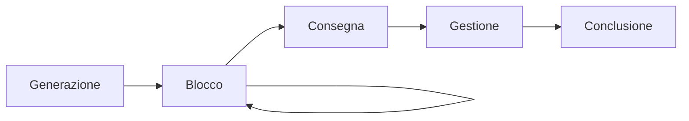

I **segnali in [UNIX](UNIX.md)** sono un meccanismo di [comunicazione tra processi](Processi.md#7%20-%20Comunicazione%20tra%20processi%20(IPC)) utilizzato per notificare a un processo l'occorrenza di un evento specifico, come un errore, un'interruzione dell'utente o un'operazione speciale.

# 1 - Nomi simbolici dei segnali

Ogni segnale è associato univocamente a:
- Un **intero**, a partire dall'`1`.
- Un **nome simbolico**, della forma `SIG***`.

Poiché gli effettivi interi assegnati a ogni segnale variano a seconda delle implementazioni nei vari [sistemi operativi](Sistema%20operativo.md), all'interno dei programmi è meglio utilizzare direttamente i nomi simbolici.

# 2 - Tipi di segnali in UNIX

I **segnali in [UNIX](UNIX.md)** si dividono nelle seguenti categorie:
- **Trap**: segnali generati da un processo e inviati al processo stesso.
- **Interrupt**: segnali generati da un agente esterno (es. utente, altro processo) a un processo.
%%siamo sicuri sia questa la definizione di trap e interrupt?%%

## 2.1 - Trap

In [UNIX](UNIX.md), le **trap** sono segnali generati da eventi prodotti da un processo e inviati al processo stesso. Alcune trap sono causate da comportamenti errati del processo stesso, e immediatamente inviate al processo che normalmente reagisce terminando.

Sono esempi di trap i tentativi di divisione per zero (`SIGFPE`), indirizzamento errato degli array (`SIGSEGV`), tentativo di eseguire istruzioni privilegiate (`SIGILL`), ecc.

## 2.2 - Interrupt

In [UNIX](UNIX.md), gli **interrupt** sono segnali inviati ad un processo da un agente esterno (come l'utente o un altro processo).

Esempi di interrupt inviati dall'utente sono la pressione delle combinazione di tasti `CTRL+C` (`SIGINT`) o `CTRL+Z` (`SIGSTOP`) durante l'esecuzione di un processo, mentre un interrupt inviato da un altro processo può essere la system call `kill()`%%link%%.

# 3 - Ciclo di vita dei segnali in UNIX

In [UNIX](UNIX.md), i segnali hanno il seguente ciclo di vita:



1. [**Generazione del segnale**](Segnali%20in%20UNIX.md#4%20-%20Generazione%20di%20un%20segnale): il segnale viene creato come risultato di un evento specifico e viene posto in una coda di segnali pendenti%%link%% associata al processo destinatario.
2. **Blocco del segnale**: dopo la sua generazione, si può impedire temporaneamente che un segnale venga consegnato a un processo. Invece di essere immediatamente gestito, il segnale rimane in uno stato di pendenza finché non viene sbloccato.
3. **Consegna del segnale**: quando il processo destinatario è attivo, il kernel controlla se ci sono segnali pendenti per quel processo. Se il segnale non è bloccato, allora viene recapitato, altrimenti rimane in stato pendente fino a quando non può essere gestito. Alcuni segnali, come `SIGKILL`, vengono consegnati immediatamente e non possono essere bloccati o ignorati.
4. [**Gestione del segnale**](Segnali%20in%20UNIX.md#5%20-%20Gestione%20del%20segnale): una volta consegnato, il segnale viene gestito dal processo a cui è stato recapitato. 
5. **Conclusione del segnale**: una volta gestito, il segnale esce dalla coda dei segnali pendenti. Se il segnale ha attivato un'azione (ad esempio, la terminazione del processo), il ciclo di vita del segnale termina con l'esecuzione dell'azione predefinita o personalizzata.

# 4 - Generazione di un segnale

Durante la **generazione del segnale**, il segnale viene creato come risultato di un evento specifico e  viene posto in una coda di segnali pendenti%%link%% associata al processo destinatario.

## 4.1 - Fonti di generazione di un segnale

La **generazione di un segnale** può essere causato da diversi eventi o sorgenti:
- **Evento hardware**: l'hardware ha verificato una condizione di errore che è stata notificata al kernel%%link%%, il quale a propria volta ha inviato un segnale corrispondente al processo in questione. Per esempio, l'esecuzione di istruzioni di linguaggio macchina malformate (`SIGILL`), divisioni per $0$ (`SIGFPE`), o riferimenti a parti di memoria inaccessibili (`SIGSEGV`).
- **Evento software**: eventi che non derivano direttamente dall'hardware ma sono causati da azioni compiute da processi, dal kernel o da altre operazioni software. Per esempio, l'input è divenuto disponibile su un descrittore di file (`SIGIO`), un timer è arrivato a $0$ (`SIGALRM`), il tempo di processore per il processo è stato superato (`SIGXCPU`) o un figlio del processo è terminato (`SIGCHLD`).
- **Azione dell'utente**: l'utente ha digitato sul terminale combinazioni di tasti che generano i segnali, per esempio `CTRL + C` (`SIGINT`) o `CTRL + Z` (`SIGTSTP`).

### 4.1.1 - Evento hardware

### 4.1.2 - Evento software

### 4.1.3 - Azione dell'utente

## 4.2 - Generazione di un segnale con `kill()`

L'API%%link%% `kill()` è uno dei metodi principali per generare segnali. Può essere utilizzata per inviare segnali sia al processo chiamante che ad altri processi.

> [!esempio] Esempio in C
> 
> ```c
> #include <signal.h>
> #include <unistd.h>
> #include <stdio.h>
> 
> int main() {
>     pid_t pid = getpid();  // Ottiene il PID del processo corrente
> 
>     printf("Generazione di SIGUSR1 per il processo corrente\n");
>     raise(SIGUSR1);  // Invia SIGUSR1 al processo chiamante
> 
>     printf("Inviando SIGTERM al processo corrente tramite kill()\n");
>     kill(pid, SIGTERM);  // Invia SIGTERM al processo corrente
> 
>     return 0;
> }
> ```

## 4.3 - Segnali `SIGUSR1` e `SIGUSR2`

I segnali `SIGUSR1` e `SIGUSR2` sono segnali definiti dall'utente. Sono segnali generici che non hanno un'azione predefinita specifica (a parte la terminazione del processo, se non gestiti) e vengono solitamente utilizzati per notifiche o comunicazioni personalizzate tra processi.

I numeri assegnati a `SIGUSR1` e `SIGUSR2` possono variare tra i sistemi, ma tipicamente sono rispettivamente `10` e `12`.

> [!consiglio] Consiglio
> È possibile verificare la numerazione dei segnali nel proprio sistema operativo eseguendo il comando:
> ```shell
> kill -l
> ```

### 4.3.1 - Uso tipico

- **Notifiche personalizzate**: segnalare eventi specifici tra processi.
- [**Comunicazione tra processi (IPC)**](Processi.md#7%20-%20Comunicazione%20tra%20processi%20(IPC)): permettere ai [processi](Processi.md) di scambiarsi informazioni senza passare per meccanismi complessi come [pipe](Pipe.md) o [socket](Socket.md).
- **Debugging**: utilizzati per notificare lo stato interno di un'applicazione durante il debug.

> [!esempio] Esempio in C
> 
> 
> ```c
> #include <stdio.h>
> #include <stdlib.h>
> #include <signal.h>
> #include <unistd.h>
> 
> // Gestore per SIGUSR1
> void handle_sigusr1(int signo) {
>     printf("Ricevuto SIGUSR1 (segnale %d)\n", signo);
> }
> 
> // Gestore per SIGUSR2
> void handle_sigusr2(int signo) {
>     printf("Ricevuto SIGUSR2 (segnale %d)\n", signo);
> }
> 
> int main() {
>     // Configura i gestori per SIGUSR1 e SIGUSR2
>     signal(SIGUSR1, handle_sigusr1);
>     signal(SIGUSR2, handle_sigusr2);
> 
>     printf("Processo in esecuzione (PID: %d). Inviare SIGUSR1 o SIGUSR2.\n", getpid());
> 
>     // Ciclo infinito in attesa dei segnali
>     while (1) {
>         pause();  // Attende un segnale
>     }
> 
>     return 0;
> }
> ```

%%
Per usare questo esempio, compilare ed eseguire il programma in C e inviare i segnali al processo usando il comando `kill`:
```shell
kill -SIGUSR1 <PID>
kill -SIGUSR2 <PID>
```
%%

# 5 - Gestione del segnale

Un processo può decidere come gestire i segnali che riceve. Le opzioni di gestione sono:
- **Azione predefinita**: ogni segnale ha un'azione predefinita, che può includere la terminazione, la sospensione o l'ignorazione del processo.
- **Cattura del segnale**: un processo può registrare una funzione (detta _signal handler_) per gestire un segnale specifico tramite le [funzioni `signal()` e `sigaction()` in C](Segnali%20in%20UNIX.md#2.1%20-%20Funzioni%20`signal()`%20e%20`sigaction()`%20in%20C).
- **Ignorare un segnale**: un processo può decidere di ignorare alcuni segnali, come `SIGINT`, usando una funzione di gestione personalizzata (quando ciò è possibile).

## 5.1 - Funzioni `signal()` e `sigaction()` in C

In C, le **funzioni `signal()` e `sigaction()`** sono utilizzate per gestire i segnali attraverso funzioni specificate dall'utente, dette _signal handler_.

La funzione `signal()` è una maniera più semplice per associare un gestore a un segnale. La sua dichiarazione è la seguente:
```c
void (*signal(int sig, void (*handler)(int)))(int);
```
dove:
- **`sig`**: è il numero del segnale (ad esempio, `SIGINT` per l'interruzione da tastiera).
- **`handler`**: è il puntatore alla funzione che gestirà il segnale, la quale prende un parametro di tipo `int` (tipicamente il numero del segnale).

> [!esempio]
> ```c
> #include <stdio.h>
> #include <signal.h>
> 
> void handler(int sig) {
>     printf("Ricevuto segnale %d\n", sig);
> }
> 
> int main() {
>     signal(SIGINT, handler);  // Associa il gestore per SIGINT
>     return 0;
> }
> ```

Tuttavia, `signal()` ha delle limitazioni (come un comportamento meno prevedibile su alcune piattaforme) e non è raccomandata per un uso robusto in programmi complessi.

La funzione `sigaction()` è una versione più potente e sicura per gestire i segnali. Permette un controllo più fine, come il blocco temporaneo dei segnali durante l'esecuzione del gestore. La sua dichiarazione è la seguente:
```c
int sigaction(int sig, const struct sigaction *act, struct sigaction *oldact);
```
dove:
- **`sig`**: il segnale che si vuole gestire.
- **`act`**: un puntatore a una struttura `sigaction` che descrive come deve essere gestito il segnale.
- **`oldact`**: un puntatore a una struttura `sigaction` in cui verrà memorizzato il gestore precedente (può essere `NULL`).

### 5.1.1 - Struttura `sigaction`

La **struttura `sigaction`** è così definita:
```c
struct sigaction {
    void (*sa_handler)(int);
    sigset_t sa_mask;
    int sa_flags;
    void (*sa_restorer)(void);
};
```
dove:
- **`sa_handler`**: è la funzione gestore.
- **`sa_mask`**: maschera di segnali%%cazzo è una maschera di segnali?%%%%link%% da bloccare durante il gestore.
- **`sa_flags`**: flag per personalizzare il comportamento dell'handler.
- **`sa_restorer`**: tradizionalmente, questo campo poteva essere usato per restituire il controllo al sistema operativo dopo l'esecuzione del gestore del segnale. Tuttavia, oggi è obsoleto e non viene utilizzato in molte implementazioni.

> [!esempio]
> ```c
> #include <stdio.h>
> #include <signal.h>
> 
> void handler(int sig) {
>     printf("Ricevuto segnale %d\n", sig);
> }
> 
> int main() {
>     struct sigaction sa;
>     sa.sa_handler = handler;  // Imposta il gestore
>     sigemptyset(&sa.sa_mask);  // Nessun segnale è bloccato durante l'esecuzione
>     sa.sa_flags = 0;  // Nessun flag particolare
>     sigaction(SIGINT, &sa, NULL);  // Associa il gestore a SIGINT
>     return 0;
> }
> ```

### 5.1.2 - Meglio usare `signal()` o `sigaction()`?

Solitamente, `sigaction()` è preferita rispetto a `signal()` per i seguenti motivi:
- **Flessibilità**: `sigaction()` permette di bloccare temporaneamente altri segnali durante l'esecuzione del gestore e offre maggiore controllo sui segnali.
- **Compatibilità**: `signal()` può avere un comportamento imprevisto su alcune piattaforme, mentre `sigaction()` è più robusta e portabile.
- **Controllo avanzato**: Con `sigaction()` puoi specificare una maschera di segnali da bloccare durante l'esecuzione del gestore e altre opzioni, mentre `signal()` è più semplice ma meno potente.

# Fonti

- Slide del Prof. Schifanella Claudio del corso di Laboratorio di Sistemi Operativi (canale B, turno T4), Corso di Laurea in Informatica presso l'Università di Torino, A.A. 2024-25:
	- [Slide: i segnali](https://informatica.i-learn.unito.it/mod/resource/view.php?id=254494)
%%
da vedere:
- https://didawiki.di.unipi.it/lib/exe/fetch.php/lcs/lcs06/esercitazioni/11segnali.pdf
%%

